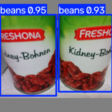
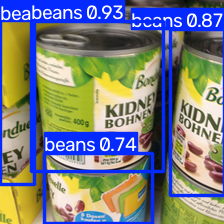
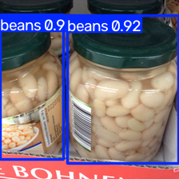
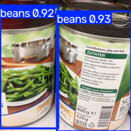
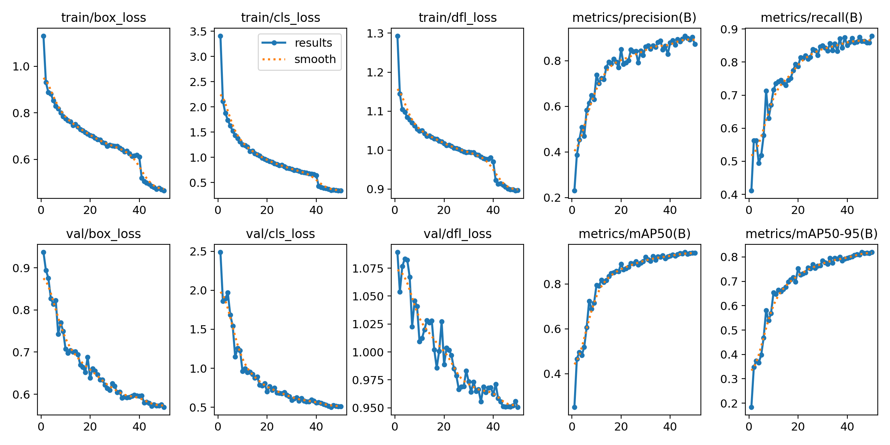
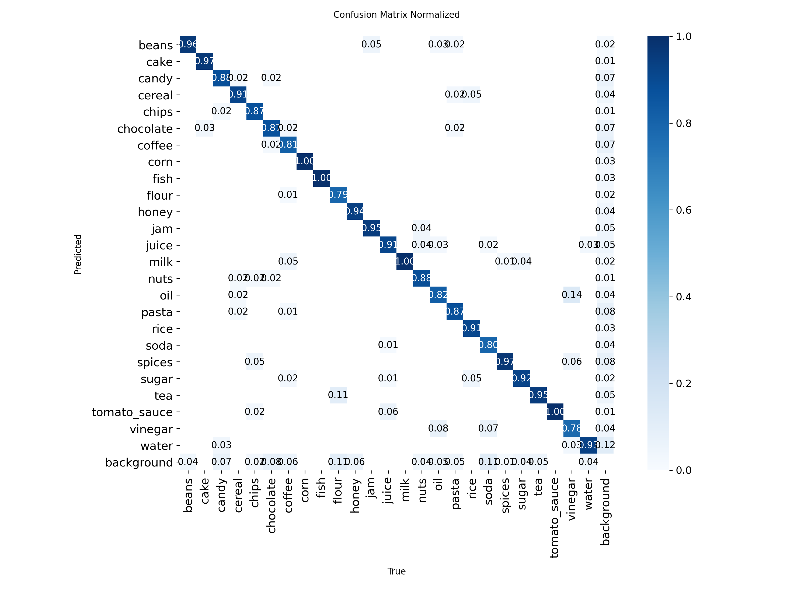
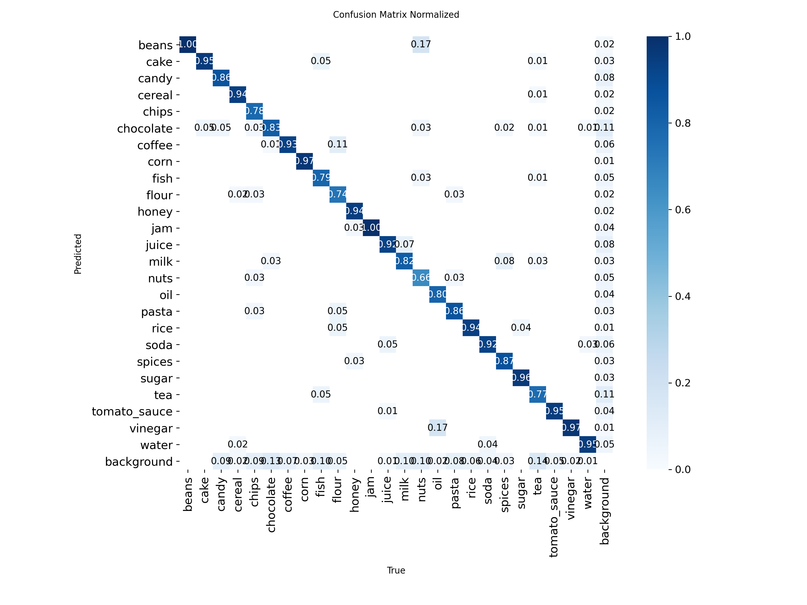

# Retail Product Detection

End-to-end multi-class grocery product detection using PyTorch/YOLO,
with dataset validation, controlled model comparison, ONNX export,
CPU benchmarking, and FastAPI inference.

## Problem

Retail computer-vision systems need to identify and localize products
under variations in viewpoint, occlusion, truncation, and packaging.

This project builds a 25-class grocery product detector and follows the
complete pipeline:

Dataset → Validation → Training → Evaluation → Error Analysis →
Model Comparison → ONNX Export → Benchmarking → FastAPI

## Example Predictions

The final YOLO11s model detects and classifies grocery products with
bounding boxes and confidence scores.

<p align="center">
  
  
</p>

<p align="center">
  
  
</p>

### Training Curves



### Validation Confusion Matrix



### Final Test Confusion Matrix



## Dataset

The project uses the 5K Groceries Object Detection Dataset, an extension
of the Freiburg Groceries Dataset.

Dataset characteristics:

- 4,947 images
- 25 grocery classes
- 11,663 annotated objects
- Pascal VOC bounding-box annotations
- 224×224 RGB images
- Average 2.36 objects per image

During dataset validation, one malformed zero-width bounding box was
identified and excluded during preprocessing.

### Split

A reproducible class-stratified split was created:

| Split | Images |
|---|---:|
| Train | 3,957 |
| Validation | 495 |
| Test | 495 |

The test set was kept untouched during model selection.

## Preprocessing

Pascal VOC annotations:

`[xmin, ymin, xmax, ymax]`

were converted to YOLO normalized format:

`[class_id, x_center, y_center, width, height]`

Converted labels were visually validated by transforming the normalized
coordinates back to pixel coordinates and overlaying them on the source
images.

## Baseline

The first model was a COCO-pretrained YOLO11n trained at the native
224×224 image resolution.

Validation results:

| Metric | YOLO11n |
|---|---:|
| Precision | 0.845 |
| Recall | 0.834 |
| mAP@0.50 | 0.892 |
| mAP@0.50:0.95 | 0.754 |

Training curves showed steadily decreasing train and validation losses
without obvious overfitting.

## Error Analysis

The normalized confusion matrix showed that most classes were strongly
separated, while some visually related categories produced more errors.

Examples included:

- flour / sugar
- oil / vinegar
- weaker performance on chocolate, soda, pasta, and nuts

The errors suggested that classification capacity was a more useful
next experiment than simply increasing input resolution.

## Model Improvement

Hypothesis:

A slightly larger detector may improve discrimination between visually
similar grocery classes.

The same training configuration was therefore repeated using YOLO11s.

| Metric | YOLO11n | YOLO11s |
|---|---:|---:|
| Precision | 0.845 | 0.872 |
| Recall | 0.834 | 0.879 |
| mAP@0.50 | 0.892 | 0.939 |
| mAP@0.50:0.95 | 0.754 | 0.820 |

YOLO11s was selected as the final model.

## Final Test Results

The selected model was evaluated once on the previously untouched
495-image test set containing 1,173 objects.

| Metric | Test Result |
|---|---:|
| Precision | 0.897 |
| Recall | 0.849 |
| mAP@0.50 | 0.917 |
| mAP@0.50:0.95 | 0.797 |

## ONNX Export

The final PyTorch checkpoint was exported to ONNX.

PyTorch and ONNX inference were compared on the same image and produced:

- identical number of detections
- identical predicted classes
- matching confidence values
- matching bounding-box coordinates

This verified that model behavior was preserved after export.

## CPU Benchmark

Benchmark environment:

- Intel Core i5-1135G7
- CPU inference
- 224×224 input
- 100 test images
- warm-up before measurement

| Runtime | Latency | Throughput |
|---|---:|---:|
| PyTorch | 40.56 ms/image | 24.65 FPS |
| ONNX Runtime | 56.32 ms/image | 17.75 FPS |

ONNX Runtime was slower than PyTorch for this particular model and CPU
configuration. This demonstrates that model export does not
automatically guarantee faster inference and should be benchmarked on
the target hardware.

## API

The ONNX model is served through FastAPI.

Start the API:

```bash
uvicorn src.api:app --reload